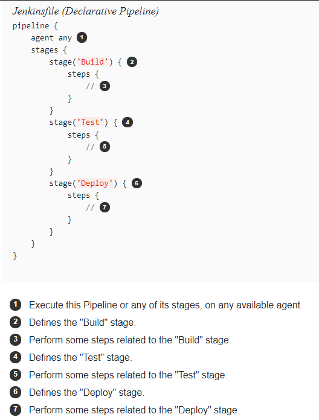

# Lift And Shift a JEE Application to OCI

This workshop guides you through the setup, and the configuration of a Jenkins Pipeline in order to create a JEE Application on Oracle Cloud Infrastructure Gen 2 (OCI). The application is named 'Medrec'. It has been a standard JEE demo application on WebLogic Server for many years.

This application needs :

- A relational database like Oracle Database for example. 
- Some JEE servers with resources deployed (datasource, jms, ...).
- A Load balancer in front of the JEE servers.
- A DNS Zone management in order to call easily the application in a browser.

 with the schema of an application called "Medrec". 

The goal of the pipeline is :

- Create an Autonomous Transaction Processing Database (Atp) with `terraform`
- Create the schema "Medrec" (tables & data) with `SQLcl`
- Create a Kubernetes Cluster with `terraform`
- Create the Docker image of the JEE medrec application using Atp
- Deploy the Docker Image on our Kubernetes Cluster.

Note that each part of the infrastructure is full secured and scalable without service interruption !!!

We will use Jenkins2 Pipeline As Code for this demo because this is a very powerfull solution, and today 'Infra As Code [DevOps]' is everywhere. Note that you update the code, you update the pipeline !!!

Do not hesitate to use it and ask for enhancements if you have any ideas. 

## Table of Contents

1. Pre-requisites [01-prereq.md](docs/01-prereq.md)
2. Autonomous Transaction Processing DevOps [02-atp.md](docs/02-atp.md)
3. Oracle Kubernetes Engine DevOps [03-kubernetes.md](docs/03-kubernetes.md)
4. Medrec Docker Packaging with WebLogic Server and Deployment on Kubernetes [04-medrec.md](docs/04-medrec.md)
5. DNS Zone Management [05-dns.md](docs/05-dns.md)
6. Scale your infrastructure [06-scale.md](docs/06-scale.md)

## Feedback

If you like this repository, do not hesitate to add a star. If you have any
questions or ideas to enhance it, open an issue. Have fun!