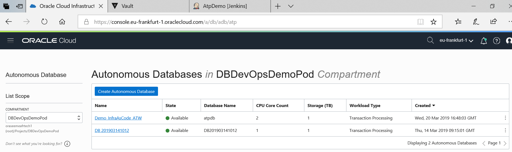

# Pre-requisites

## Install the required components

1) you need an OCI account. So you need :

- Cloud Account Name (= tenant). Ex : gse00012345.
- Cloud User. Ex : devopsdb.user1
- Cloud Password. Ex : Alpha_2014_!

If you don't do the workshop with Oracle then you can do a [Trial](https://cloud.oracle.com/en_US/database). 

2) You need a github account.

3) You need a docker hub account.

2) You need a Jenkins2 server ready.

Note : instead of installing all the good components needed on Jenkins Host, you can use a Docker image that already has all what you need. You can find a sample Docker image on github [there](https://github.com/cpruvost/infraascode)

3) You need a Vault server ready. We will use Hashicorp Vault in order to store all the information about our Cloud Account and all the SSH keys.

4) You need some 'classic' products for 'Infra As Code'. These products should be available on the jenkins2 host agent or in the docker image used by the jenkins2 pipeline.

- [Terraform](https://www.terraform.io/downloads.html) You can download and uncompress it so that it can be accessed from your `PATH`. It might also be installed from your favorite package manager.
- The [OCI Command Line Interface](https://github.com/oracle/oci-cli) or OCI CLI. The fastest way to get the latest version on Mac/Linux, assuming you have `python` or `python3` installed with `pip`, is to run `sudo pip install oci-cli`.
- [Oracle SQLcl](https://www.oracle.com/technetwork/developer-tools/sqlcl/overview/index.html), that replaces the old SQL*Plus in 12c. We need to have Oracle Instant Client installed too if you want to use a sqlcl oci connection to Atp.
- [Git](https://git-scm.com/downloads)
- You might also need to install and use more tools, like `jq`, `ssh`, `openssl`, `curl`...

5) You need [Oracle SQL Developer](https://www.oracle.com/database/technologies/appdev/sql-developer.html) to connect to Atp.

## Note : You have to know well Oracle Cloud Infrastructure and all the required components there if you want to reproduce this pipeline. It will be too long to explain all these products one by one....sorry..

Next [02-atp.md](02-atp.md)