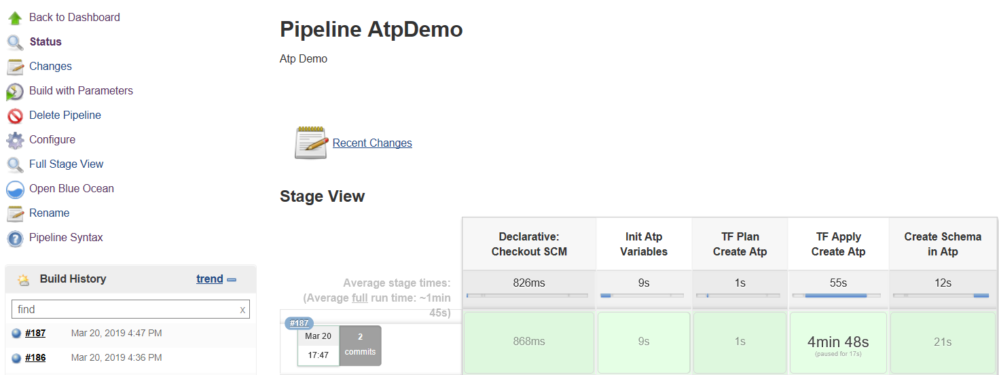
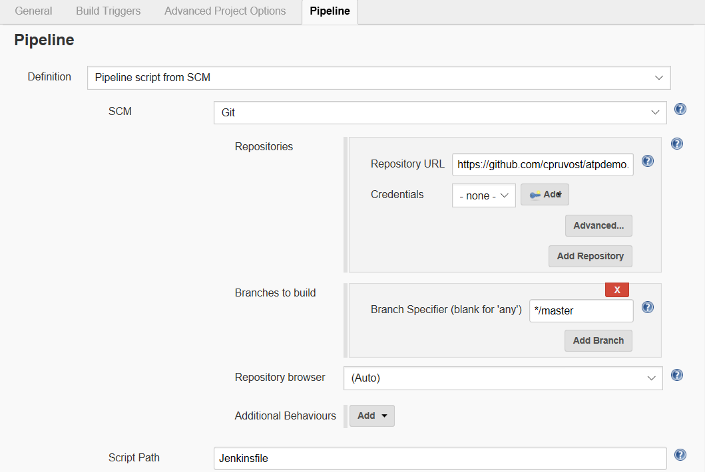
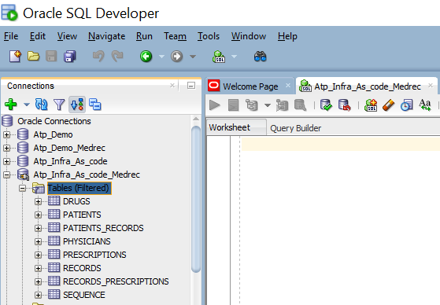

# Autonomous Transaction Processing DevOps

The goal of the first part of the pipeline is :

- Create an Autonomous Transaction Processing Database (Atp) with `terraform`
- Create the schema "Medrec" (tables & data) with `SQLcl`

Note that you get an Autonomous Transaction Processing Database in about 5 min !!!

## Steps Description

#### `Declarative:Checkout SCM`

This step does a 'git clone' in order to get the github repository of this demo.

#### `Init Atp Variables`

Check that all required components (terraform, oci cli, sqlcl,...) are there and get all information concerning the Cloud account from Vault.

#### `TF Plan Create ATP`

Do a terraform init to get the required plugins (ex provider.oci v3.18.0 --> needed by terraform for working with Oracle Cloud) and do a terraform plan in order to define what are the Cloud resources that will be created.

#### `TF Apply Create ATP`

Do a terraform apply in order to create the resources (Atp). After creating the database it download the wallet.zip that contains all the security files needed for a connection to the database.  

#### `Create Schema in Atp`

Do a sqlcl script in order to create the schema application (Medrec) with tables and data. 

## Check the Database with Oracle SQL Developer

After downloading the wallet.zip from the Oracle Cloud UI, you create a connection to Atp (schema : medrec) in Oracle SQL Developer.

Next [03-kubernetes.md](03-kubernetes.md)
