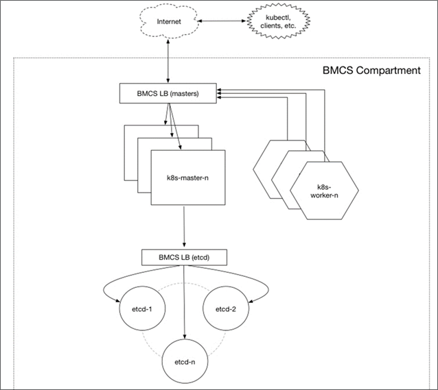
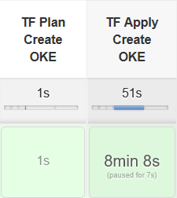
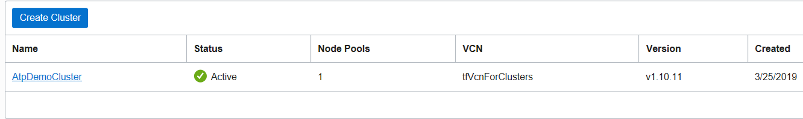

# Oracle Kubernetes Engine DevOps

The goal of the second part of the pipeline is :

- Create a Kubernetes Cluster on OCI gen2 with `terraform`

Note that on OCI the Kubernetes Cluster is highly available because it uses all the 3 datacenters of a region (ex : frankfurt). 

 

On the pipeline we have 2 steps = a terraform plan and a terraform apply (idem as Atp)

So it takes about 8 min in order to create a hight availability Kubernetes Cluster on OCI

Next [04-medrec.md](04-medrec.md)

