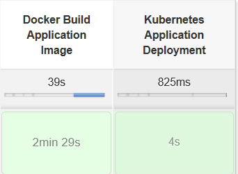
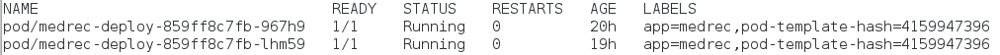
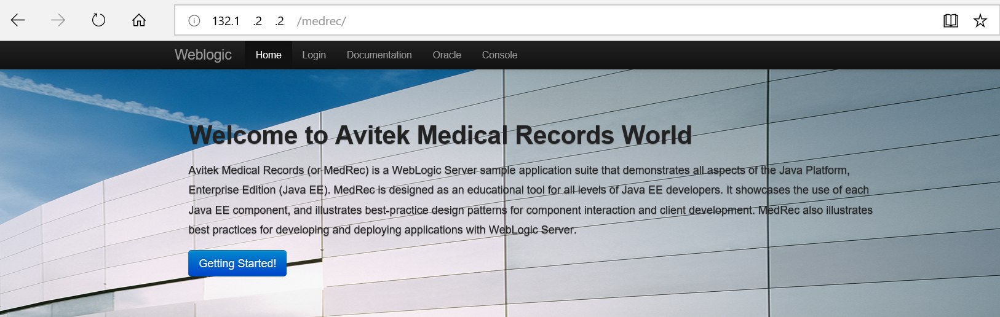

# Autonomous Transaction Processing DevOps

The goal of the third part of the pipeline is :

- Build the Docker image of Medrec Application deployed on WebLogic Server
- Deploy the Docker image of Medrec Application on Kubernetes



Note that build the Docker image is quite long. Actually Medrec is a real JEE application that needs :

- a JEE server (WebLogic here)
- Resources created on the JEE server (Datasource, JMS, ...)

If you look at the Dockerfile you will see that we are able to create all the resources of Medrec with a WebLogic Scripting Tool (wlst). This tool can work offline and it is very nice because during the Build WebLogic Server is not started !!!.

```
Dockerfile

....

//Add Wls ressources for medrec (datasource and jms)

RUN wlst -loadProperties /u01/oracle/datasource.properties.oracle.txt /u01/oracle/MedrecDatasource.py
RUN wlst -loadProperties /u01/oracle/jms.properties.txt /u01/oracle/MedrecJms.py

...
```

After the build the image is push on DockerHub, then deploy on our Kubernetes cluster using kubectl (the Kubernetes client).

```
The Kubernetes Deployment

apiVersion: apps/v1
kind: Deployment
metadata:
  name: medrec-deploy

spec:
  replicas: 2
  selector:
    matchLabels:
      app: medrec
  template:
    metadata:
      labels:
        app: medrec
    spec:
      containers:
      - name: medrec-server
        image: cpruvost/12213-wls-medrec-if:latest
        ports:
        - name: medrec-port
          containerPort: 7001
          protocol: TCP
```

and 

   ```
    The Kubernetes Service 
    
    apiVersion: v1
    kind: Service
    metadata:
      name: medrec-service
      labels:
        app: medrec
    spec:
      ports:
    
    - port: 80
      targetPort: 7001
        selector:
      app: medrec
        type: LoadBalancer
   ```

We can see on kubernetes the 2 pods that runs our image



The Kubernetes Service uses the Load Balancer Cloud Service of OCI in order to expose the Medrec Application with a public IP like "132.**.***.**"


So now we can call Medrec in our browser



Next [05-dns.md](05-dns.md)

