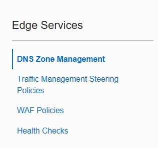

# DNS Zone Management

The goal of last part of the pipeline is :

- Create the DNS definition in order to call easily Medrec in a browser. 

Then after that you have to buy a domain name (ex : atpdemo.net) that will point to the dns servers of Oracle.

And then call the Medrec application in your brower

Note : if you want you can define a Web Application Firewall to protect Medrec...:o)

Next [06-scale.md](06-scale.md)

