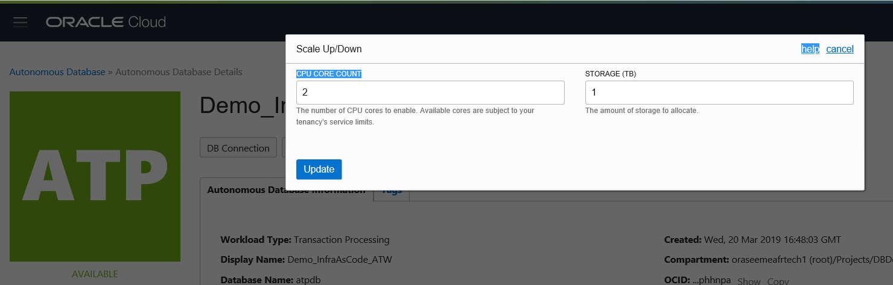
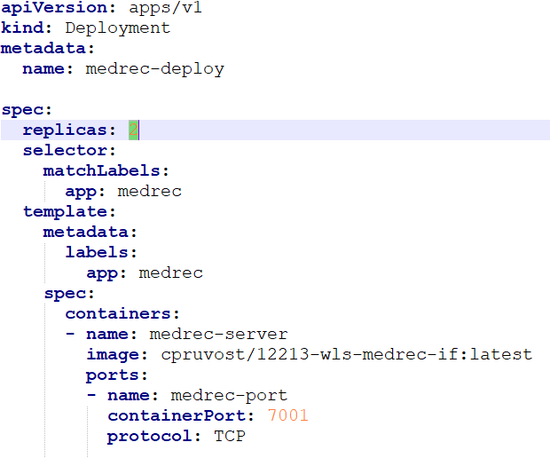
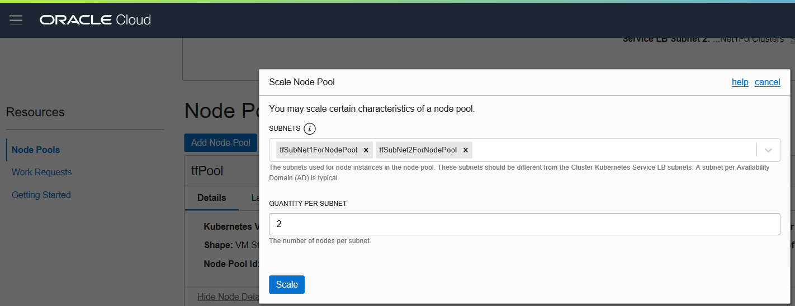
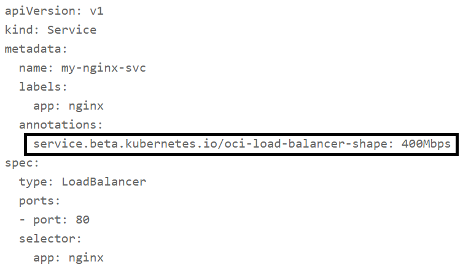

# Scale your infrastructure

All the scale up/down are without service interruption.

You can scale up/down Autonomous Transaction Processing.

You can scale up/down the number of containers (with WebLogic Server and Medrec) just changing the number of replicas

You can scale up/down the number of kubernetes workers (= number of VMs running containers)

You can scale up/down the Load Balancer Service (used by Kubernetes Service)

